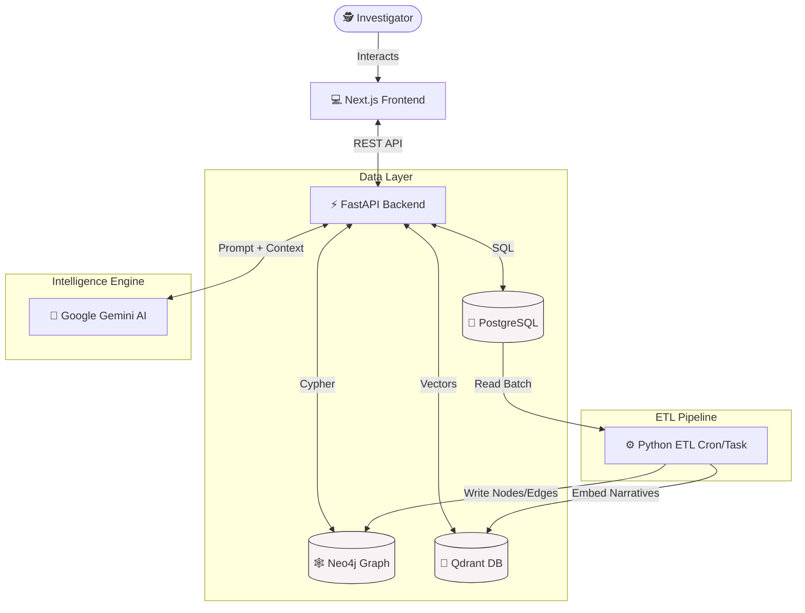
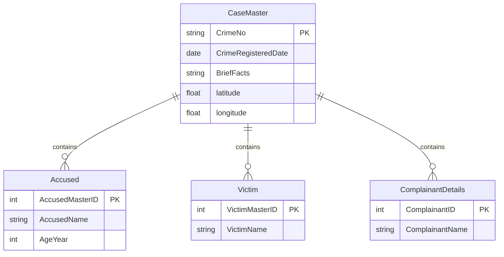
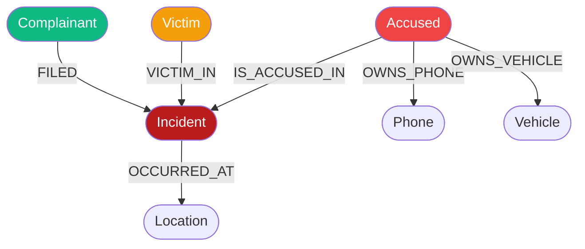
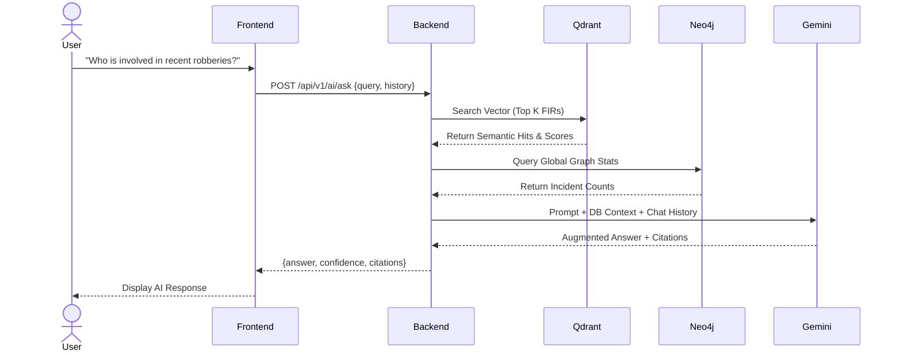
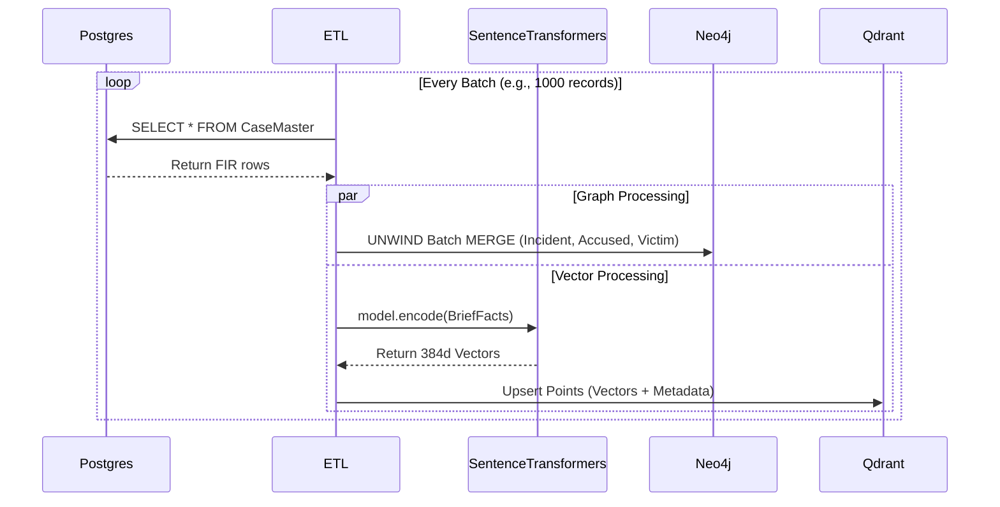

# 👁️ K-Sight - Crime Intelligence & Investigation Platform

> **Built for the Karnataka State Police x Zoho Datathon**

K-Sight is an elite, polyglot-persistence intelligence platform designed to transform raw police records into actionable investigative intelligence. It connects the dots between isolated incidents to uncover hidden organized crime networks.

## 🚀 Key Features

- **Hybrid RAG AI Chatbot**: Powered by Google Gemini, Qdrant, and Neo4j. Ask complex questions like *"What is the MO for recent robberies?"* and the AI will scan semantic FIR narratives and graph relationships to give you cited intelligence.
- **Graph Investigator**: A ReactFlow-powered visualizer that exposes hidden syndicates by linking Suspects 🔴, Phones 🔵, Vehicles 🟢, and Incidents 🟡. Features dynamic Suspect Risk Scoring and Similar Past Cases retrieval.
- **Live Operations Map**: A geospatial heatmap plotting crime incidents to identify high-risk zones.
- **Automated Intelligence ETL**: A pipeline that automatically embeds and graphs raw FIR data from PostgreSQL into Neo4j and Qdrant.

---

## 🏗️ System Architecture

K-Sight utilizes a highly scalable, polyglot architecture to handle structured records, relationships, and semantic search simultaneously.



---

## 🗄️ Database Schemas

### Relational Schema (PostgreSQL)
The structured source of truth for FIR records, lookup tables, and personnel.



### Knowledge Graph Schema (Neo4j)
Designed for multi-hop relationship traversals to uncover organized syndicates.



---

## 🔄 Core Workflows

### 1. Hybrid RAG (AI Chatbot) Query Flow
How the Intelligence Assistant answers questions using multi-modal data.



### 2. Automated ETL Ingestion Pipeline
How structured data is transformed into intelligence assets.



---

## ⚙️ Setup & Installation

Follow these instructions to run the entire intelligence platform locally.

### 1. Start the Infrastructure (Docker)
Ensure Docker Desktop is running on your machine, then spin up the databases:
```bash
docker-compose up -d
```
*(This will start Neo4j, Qdrant, Postgres, and Redis).*

### 2. Configure Environment Variables
Create a `.env` file from the example template and add your Google Gemini API key:
```bash
cp .env.example .env
```
Open the `.env` file and set `GEMINI_API_KEY=your_actual_api_key_here`. 
*(Note: If no key is set, the system will fall back to a hardcoded mock mode, but the AI won't generate real responses).*

### 3. Setup the Python Backend
Open a terminal in the root directory and create a virtual environment:
```bash
python -m venv venv
.\venv\Scripts\activate
pip install -r backend/requirements.txt
```

### 4. Generate Mock Data & Run the ETL Pipeline
We have included a mock data generator that creates 1,000 synthetic FIRs with hidden crime syndicates for testing.
```bash
# 1. Generate the data
cd backend
python -m src.tasks.data_generator

# 2. Run the ETL Pipeline to populate Neo4j and Qdrant
python -m src.tasks.etl_pipeline
cd ..
```

### 5. Start the Application Servers
You will need two terminal windows for this.

**Terminal 1 (Backend):**
```bash
cd backend
.\venv\Scripts\activate
uvicorn main:app --reload --host 0.0.0.0 --port 8000
```

**Terminal 2 (Frontend):**
```bash
cd frontend
npm run dev
```

### 6. Access the Platform
Open your browser and navigate to:
👉 **[http://localhost:3000](http://localhost:3000)**

---

## 🛡️ Built With Purpose
*Developed to empower the Karnataka State Police with next-generation investigative capabilities.*
